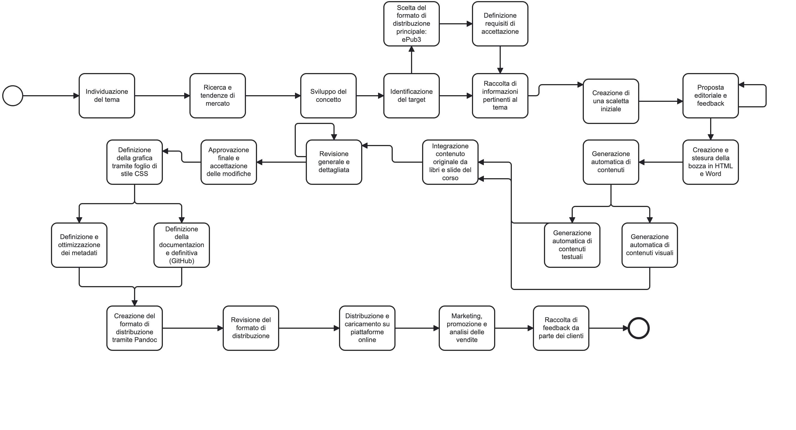

{width=100px height=100px}

# L'IA nel processo editoriale

## Introduzione

L'obiettivo di questo progetto è stato quello di applicare alcune delle metodologie e degli strumenti presentati durante il corso per realizzare un libro digitale (ebook) seguendo le specifiche dello standard ePub (Electronic Publication). Le principali caratteristiche di questo standard sono presentate di seguito. Il libro è stato inizialmente redatto in HTML (HyperText Markup Language) e in formato Word (DOCX), e successivamente convertito in ePub e PDF utilizzando Pandoc, un potente strumento di conversione che verrà brevemente descritto sotto.

Il tema centrale della pubblicazione è l'applicazione dell'intelligenza artificiale (IA) all'interno delle diverse fasi del processo di produzione editoriale, dalla fase di acquisizione dei contenuti fino alla distribuzione del prodotto. Come indicato anche all'interno del libro, a scopo didattico, alcuni dei contenuti sono stati generati proprio mediante l'utilizzo dell'intelligenza artificiale, al fine di verificarne l'affidabilità e la coerenza nell'automazione della scrittura dei contenuti. Questi contenuti sono stati controllati dall'autore e si sono dimostrati coerenti con l'argomento del libro, dimostrando che l'intelligenza artificiale può essere uno strumento utile nell'automazione della produzione di semplici contenuti editoriali.

## Ideazione

### Tema

In questa fase iniziale, ma fondamentale per la creazione dell'opera, si è individuato il tema e si è definito il concetto principale
della pubblicazione, quindi in questo caso l'argomento principale di un'opera che può essere collegata alla didattica. 
Sono state fatte ricerche e analisi delle tendenze attuali nel settore editoriale ed è stato individuato il target dell'opera, ovvero
i [destinatari](#destinatari) che verranno descritti qui sotto. Si sono raccolte informazioni relative al tema 
dell'intelligenza artificiale nel processo editoriale, impiegando anche strumenti e operatori di ricerca avanzata come quelli di Google, al fine
di esplorare anche gli argomenti correlati che influenzano e arricchiscono la comprensione del contesto. Inoltre, in questa fase sono state analizzate le tendenze 
attuali e future nell'attenzione su questi temi.

Gli argomenti correlati:

* **Automazione nella produzione editoriale**
* **Intelligenza artificiale e content creation**
* **Analisi dei dati e predizione**
* **Marketing e distribuzione digitale**
* **Etica e implicazioni dell'IA**

Le tendenze all'attenzione su questi temi:

* **Crescente interesse nell'automazione**: c'è una crescente attenzione verso 
  l'automazione dei processi editoriali, con molti editori che investono in 
  tecnologie avanzate per migliorare l'efficienza e ridurre i costi.
* **Adattamento all'IA per la personalizzazione**: l'uso dell'IA per creare contenuti personalizzati è una delle tendenze più rilevanti.
* **Focalizzazione sull'analisi dei dati**: con l'aumento della disponibilità 
  di dati, c'è una maggiore enfasi sull'analisi dei big data per prendere decisioni 
  informate.
* **Considerazioni etiche e sociali**: mentre l'IA continua a evolversi, 
  c'è un aumento dell'attenzione sulle questioni etiche e sulle implicazioni 
  sociali del suo utilizzo.

In progetti di tipo commerciale, una volta definito nel dettaglio il tema da trattare si definisce una scaletta preliminare, che 
può contenere capitoli e sezioni principali e viene pianificato il lavoro. Successivamente la proposta del prodotto viene presentata agli editori, i quali forniranno un feedback con eventuali proposte di modifiche iniziali. 

Per quanto riguarda la gestione documentale dei contenuti dell'opera è stata 
utilizzata la piattaforma GitHub, la quale attraverso la creazione di un 
repository apposito ha permesso di avere una migliore organizzazione del progetto. 
Per dettagli maggiori si rimanda alla [sezione dedicata](#gestione-documentale).

### Destinatari

I destinatari di questo ebook sono principalmente studenti universitari delle facoltà di 
Comunicazione e Giornalismo, nonché professionisti che lavorano all'interno di case editrici o 
operano in maniera indipendente nel mondo della scrittura di libri, giornali o riviste. Segue ora un'analisi più specifica del target utilizzando il metodo delle **personas**.

La descrizione dei destinatari utilizzando il metodo delle *personas* consente di identificare ancor meglio il target
della pubblicazione andando a riconoscere più nel dettaglio le diverse esigenze, esperienze, i comportamenti e obiettivi degli utenti.
Si tratta di rappresentazioni fittizie di clienti ideali basate su dati reali e ricerche di mercato e ciascuna personas viene descritta con dettagli
come nome, età, sesso, occupazione, livello di istruzione, reddito, modelli di comportamento e atteggiamenti, motivazioni e frustrazioni.

**Personas**

1. Persona 1: Stefania, 25 anni, studentessa universitaria
   * Età: 25 anni
   * Sesso: Femmina
   * Occupazione: Studentessa universitaria di Giornalismo
   * Livello di istruzione: Laurea magistrale in corso
   * Comportamenti: Utilizza laptop e smartphone per la ricerca e la scrittura di articoli. Legge blog e segue corsi online su nuove tecnologie nel giornalismo.
   * Motivazioni: Vuole imparare come l'IA può essere utilizzata nel giornalismo per migliorare la ricerca, l'analisi dei dati e la produzione di contenuti.
   * Frustrazioni: Trova complicato integrare nuove tecnologie nei suoi progetti accademici e non è sempre sicura di quali strumenti siano i migliori.
2. Persona 2: Davide, 27 anni, redattore
   * Età: 32 anni
   * Sesso: Maschio
   * Occupazione: Redattore e correttore di bozze freelance
   * Livello di istruzione: Laurea in Comunicazione
   * Reddito: €25,000 annui
   * Comportamenti: Usa laptop e smartphone per lavorare. Cerca strumenti che possano migliorare la qualità e l'efficienza del suo lavoro.
   * Motivazioni: Vuole trovare modi per automatizzare compiti ripetitivi per dedicare più tempo alla creatività.
   * Frustrazioni: Trova difficoltà nel tenersi aggiornato con tutte le nuove tecnologie emergenti.
3. Persona 3: Paolo, 56 anni, direttore editoriale
   * Età: 56 anni
   * Sesso: Maschio
   * Occupazione: Direttore Editoriale in una casa editrice
   * Livello di istruzione: Laurea in Letteratura
   * Reddito: €60,000 annui
   * Comportamenti: Utilizza principalmente laptop e tablet per lavoro. Legge articoli su gestione editoriale e innovazioni nel settore.
   * Motivazioni: Vuole ottimizzare i processi di produzione, ridurre i costi e migliorare la qualità dei contenuti.
   * Frustrazioni: Difficoltà nell'implementare nuove tecnologie senza interrompere i flussi di lavoro esistenti.

Una volta definite le caratteristiche di ogni personas, al fine di comprendere sempre di più la realtà d'interesse, 
è stato utile predisporre degli scenari d'uso in cui si immaginano delle situazioni reali in cui le personas potrebbero
utilizzare il prodotto editoriale. Ci si è concentrati sul descrivere il contesto in cui si trovano, perchè utilizzano il 
prodotto e come questo soddisfa le loro esigenze.

**Scenari d'uso**

* Scenario 1: Ottimizzazione del flusso di lavoro editoriale

  Paolo, come direttore editoriale, è sempre alla ricerca di modi per ottimizzare il flusso di 
  lavoro della sua casa editrice. Legge l'ebook sull'IA nel processo di produzione editoriale e 
  scopre come l'IA può automatizzare la revisione delle bozze, migliorare la gestione dei 
  contenuti e personalizzare le raccomandazioni di lettura. Implementa un sistema di IA che 
  riduce i tempi di revisione, permettendo alla sua squadra di concentrarsi su compiti
  più creativi. Consulta l'ebook utilizzando prevalentemente il formato ePub.


* Scenario 2: Automazione delle attività ripetitive

  Davide è un redattore freelance che lavora su numerosi progetti contemporaneamente. 
  Spesso passa ore a correggere bozze e a formattare documenti. Dopo aver letto l'ebook, 
  inizia a utilizzare strumenti di IA per la correzione grammaticale e la formattazione   automatica. 
  Questo gli permette di risparmiare tempo prezioso, migliorare la qualità del suo lavoro e 
  accettare più incarichi. Consulta l'ebook utilizzando prevalentemente il formato ePub.

* Scenario 3: Apprendimento e integrazione di nuove tecnologie

  Stefania è una studentessa di giornalismo interessata a come l'IA possa rivoluzionare il settore. 
  L'ebook le offre una panoramica completa su strumenti di IA per la ricerca di informazioni, 
  l'analisi dei dati e la generazione automatica di testi. Utilizza queste conoscenze per il suo 
  progetto di tesi, sviluppando un prototipo di piattaforma di notizie che utilizza l'IA per 
  personalizzare i contenuti in base alle preferenze dei lettori. Consulta l'ebook utilizzando prevalentemente il formato PDF.

### Requisiti di accettazione

Per raggiungere efficacemente i destinatari di questa pubblicazione si è deciso di impiegare un modello 
di fruizione multiformato e la possibilità di avere una buona compatibilità con vari dispositivi come 
e-reader, tablet e smartphone al fine di garantire una buona flessibilità di lettura. 
Per migliorare l'accettazione da parte degli utenti si è deciso di rendere disponibile l'ebook 
in due formati altamente riconosciuti e accessibili come ePub e PDF. 
In questo modo viene garantita un'ottima qualità ed esperienza di lettura. 

ePub fa dell'estrema flessibilità e compatibilità con il numero più ampio possibile di sistemi
di lettura i suoi punti di forza, svincolandosi al massimo dalla dipendenza da hardware e software specifici.
Esistono infatti diversi software di lettura in grado di interpretare questo formato tra cui:

* **Stanza**: un software gratuito per la lettura di pubblicazioni digitali sviluppato da Lexycle. I formati supportati sono molti: ePub, Amazon Kindle, Mobipocket, PDF, HTML ecc. Il software esiste in due versioni: per iPhone/iPad e Desktop (Mac e Windows).
* **FBReader**: un software gratuito, open source e multipiattaforma per la lettura dei libri digitali; è in grado di funzionare infatti sia su desktop che su dispositivi mobili, in particolare su quelli con sistema operativo Android. Supporta una grande varietà di formati quali ePub, Palm, Mobipocket ecc.
* **Bookworm**: una piattaforma online e gratuita per gli ePub. Permette di creare la propria biblioteca di ePub online e di leggere libri su qualsiasi dispositivo dotato di browser web. Se si possiede un ereader  in grado di interpretare gli ePub, la biblioteca online può essere sincronizzata con quella del dispositivo.
* **Calibre**: software open source, multipiattaforma di gestione di ebook. Consente di creare e di leggere ebook, la conversione tra formati, la gestione dei metadati e l'organizzazione di collezioni e librerie. Supporta una gran varietà di formati tra cui ePub e Kindle Mobi.

PDF è un formato immagine ampiamente utilizzato e supportato su molte piattaforme. È riuscito nell'obiettivo di rendere possibile la condivisione e distribuzione dei documenti con testi e grafica formattati su piattaforme differenti senza alterazioni nel layout originale. La quantità di software capaci di interpretarlo e manipolarlo è ampia, 
i principali sono:

* **Acrobat Reader**: software gratuito e multipiattaforma per la lettura dei PDF, si riescono a visualizzare i file codificati in tale formato a prescindere dalla piattaforma hardware e software. Inoltre, esso dà anche la possibilità di effettuare ricerche all'interno dei file PDF.
* **Anteprima**: applicazione preinstallata su MAC OS capace di visualizzare immagini e PDF.

Per quanto riguarda gli aspetti di innovazione all'interno dell'ebook è presente un indice, che funge da menù di navigazione, contenente dei link ipertestuali che puntano ad ogni sezione dell'ebook arricchendo l'esperienza di lettura e rendendola più dinamica. I lettori possono accedere ai contenuti in maniera non sequenziale, saltando direttamente a sezioni specifiche del contenuto.

### Canali di distribuzione

I canali di distribuzione che si intendono raggiungere, ognuno con i propri formati, sono i seguenti:

1. Web
   * Il sito web ufficiale di Unimi Editore ospiterà l'ebook in formato ePub e PDF per il dowload diretto. Sarà poi possibile rendere disponibile anche altri formati.
2. Social Media
   * Per promuovere l'ebook attraverso piattaforme di social media come Facebook, Instagram, X e LinkedIn verranno resi disponibili estratti in PDF dell'ebook e un link diretto alla versione ePub. Sarà poi possibile rendere disponibili anche altri formati.
3. Market Place
   * L'ebook verrà distribuito su marketplace come Apple Books, Google Play Books e altri, utilizzando i formati ePub e PDF per garantire la compatibilità con vari dispositivi e-reader. Sarà poi possibile rendere disponibili anche altri formati
4. Intranet
   * Per le case editrici e le scuole o Università che desiderano distribuire l'ebook internamente, verrà fornita la versione in formato PDF, facile da integrare nelle piattaforme intranet.

Per quanto riguarda le **regole tipografiche e di stile**: i **paragrafi** sono brevi e ben spaziati per migliorare la leggibilità, un uso coerente di **intestazioni** e **sottotitoli** per una chiara struttura gerarchica dei contenuti e lo **stile** professionale ma accessibile, bilanciando tra formale e informale per coinvolgere sia studenti universitari che professionisti.

Per quanto riguarda l'**identità visuale**: per i titoli si utilizzeranno colori che richiamano il tema dell'intelligenza artificiale, come tonalità di blu e verde. Inoltre, per i titoli e sottotitoli si utilizzerà un font sans-serif moderno e leggibile come *Roboto* e per il corpo del testo un font per migliorare la leggibilità come *Georgia*.

## Processo di Produzione

### Acquisizione dei contenuti

Nella costruzione del prodotto editoriale,oggetto di questo progetto, sono state impiegate
fonti generabili automaticamente attraverso strumenti di intelligenza artificiale e fonti che hanno richiesto un lavoro di redazione manuale. Come già anticipato, una parte dei contenuti del prodotto sono stati generati automaticamente attraverso l'intelligenza artificiale per verificare l'affidabilità e la coerenza di questi strumenti per la generazione automatica dei contenuti. Questi contenuti generati automaticamente sono comunque stati rivisti e riletti con attenzione. Inoltre, come detto sopra, sono state utilizzate fonti che hanno richiesto un intervento di redazione manuale per l'integrazione e l'aggiunta di dettagli ulteriori. Ciò è stato fatto mediante l'aggiunta di *contributi originali* da parte dell'autore per arrichire 
il contenuto con una prospettiva personale, attraverso il libro di testo e le slide del corso, 
che hanno rappresentato un'importante risorsa offrendo punti salienti e concetti chiave opportunamnete adattati e integrati nel contenuto dell'ebook.

### Gestione documentale

{width=100px height=100px}

1. Ideazione

	* **Individuazione del tema**: identificazione dell'argomento principale su cui si baserà il 	progetto.
	* **Ricerca e tendenze di mercato**: analisi delle tendenze attuali e delle necessità del 	mercato per assicurarsi che il tema scelto sia rilevante e richiesto.
	* **Scelta del formato di distribuzione principale: ePub3**: decisione sul formato con cui il 	contenuto verrà distribuito principalmente, in questo caso ePub3.
	* **Definizione dei requisiti di accettazione**: stabilire i criteri e i requisiti necessari 	affinché il contenuto sia considerato accettabile.
	* **Raccolta di informazioni pertinenti al tema**: raccolta e aggregazione delle informazioni 	e dei dati relativi al tema scelto.
	* **Creazione di una scaletta iniziale**: creazione di un piano o un indice preliminare per 	organizzare il contenuto.
	* **Proposta editoriale e feedback**: presentazione della proposta di contenuto agli editori 	o ai revisori per ottenere feedback e suggerimenti.

2. Acquisizione dei contenuti
	* **Generazione automatica dei contenuti**: utilizzo di strumenti automatici per creare 	contenuti testuali e visuali.
	* **Integrazione contenuto originale da libri e slide del corso**: aggiunta e integrazione di 	materiale originale proveniente da libri e slide del corso.
	* **Creazione e stesura della bozza in HTML e Word**: sviluppo di una bozza del contenuto nei 	formati HTML e Word per ulteriori revisioni.

3. Revisione e redazione
	* **Revisione generale e dettagliata**: una revisione iniziale e generale per analizzare la 	coerenza logica del contenuto, la struttura e la coerenza con le linee guida, con possibilità 	di riorganizzare i capitoli. Una revisione dettagliata con la correzione di errori 	ortografici, grammaticali e di sintassi. Viene uniformato il linguaggio e lo stile 	editoriale.
	* **Approvazione finale e accettazione delle modifiche**: approvazione definitiva del 	contenuto e delle eventuali modifiche apportate.

4. Progettazione grafica
	* **Definizione della grafica tramite foglio di stile CSS**: creazione e definizione dello 	stile grafico tramite foglio di stile CSS.

5. Produzione
	* **Definizione e ottimizzazione dei metadati**: creazione e ottimizzazione dei metadati per 	migliorare la ricerca e la gestione del contenuto. 
	* **Creazione del formato di distribuzione tramite Pandoc**: utilizzo di Pandoc per 	convertire il contenuto nei vari formati di distribuzione.
	* **Revisione del formato di distribuzione: verifica della correttezza e della qualità del 	formato di distribuzione finale.
	* Definizione della documentazione e definitiva (GitHub)**: preparazione della documentazione	finale del progetto e caricamento su una piattaforma di versioning come GitHub, di cui viene 	riportato sotto il link al repository nella sezione ["Esecuzione del flusso"](#esecuzione-del-flusso).

6. Distribuzione
	* **Distribuzione e caricamento su piattaforme online**: pubblicazione e caricamento del 	contenuto sulle piattaforme online per la distribuzione.
	* **Marketing, promozione e analisi delle vendite**: attività di marketing e promozione del 	contenuto, seguite dall'analisi delle vendite per valutare il successo del progetto.
	* **Raccolta di feedback da parte dei clienti**: raccogliere feedback dagli utenti finali per 	migliorare ulteriormente il contenuto o per progetti futuri.

### Tecnologie adottate

Le tecnologie addottate nelle diverse fasi nella realizzazione di questo ebook sono:

### HTML

Acronimo di HyperText Markup Language, ossia linguaggio di marcatura per ipertesti. È concepito per definire la struttura logica di un documento e non il suo aspetto: per questo motivo la bozza dell'ebook in questione è stata redatta utilizzando questo linguaggio. I documenti HTML si aprono con l'indicazione della definizione di tipo di documento (DTD) che segnala le specifiche utilizzate e indica così implicitamente quali elementi, attributi ed entità possono essere presenti. Dopo la dichiarazione del DTD l'elemento più esterno e che comprende l'intero documento è ```<html> </html> ```, al cui interno sono sempre previste due sezioni distinte e in sequenza: l'intestazione (o *header*) compresa tra i tag ```<head> </head>``` che contiene informazioni di controllo, e il corpo della pagina (```<body> </body>```), che racchiude il contenuto vero e proprio della pagina.

### ePub

È stato creato nel 2007dall'International Digital Publishing Forum (IDPF), un consorzio di aziende che comprende editori, distributori e sviluppatori di lettori che si occupano di mantenerlo aggiornato, ed è considerato dal W3C il principale standard pubblico per la creazione di libri digitali in contrapposizione a quelli proprietari come Mobipocket o AZW di Amazon. È stato scelto un nome generico come "Electronic Publication" per indicare il fatto che tale formato può essere utilizzato per la creazione di un qualsiasi documento, come libri, riviste, giornali purchè essi siano distribuibili in formato digitale. ePub è un formato che si basa su XML ed è da considerarsi, per certi versi, una versione aggiornata e sostitutiva dell'*Open eBook* (OeBPS).
L'estensione del file è .epub e la sua caratteristica principale, essendo un formato di testo, è quella di essere "reflowable" il che significa che il contenuto può adattarsi dinamicamente alle dimensioni dello schermo del dispositivo di visualizzazione.
Il formato è costituito da tre specifiche:
* l'*Open Publication Structure* (OPS), che descrive come marcare i contenuti del file,
* l'*Open Packaging Format* (OPF), che descrive in XML la struttura del file .epub,
* l'*OEBPS Container Format* (OCF), che descrive il metodo per costruire l'archivio ZIP che conterrà la pubblicazione.

Andando ad aprire l'archivio .epub realizzato per questo progetto si può riscontrare la seguente struttura:
* il file *mimetype* con la dichiarazione del formato (*application/epub+zip*).
* la cartella *META-INF* contenente il file *container.xml*, il quale contiene il file principale dell'applicazione, il file root che il reader dovrà leggere per sapere come organizzare il documento.
* la cartella *EPUB*, che ha sostituito la directory OEBPS in EPUB3, che contiene il file content.opf*, il file *toc.ncx* e le cartelle *media*, *styles* e *text*
  Il file content.opf è detto Package File e contiene i metadati e le informazioni strutturali e bibliografiche dell'ebook. Esso è composto da un'intestazione XML e da quattro sezioni: la sezione **metadata**, che fornisce al reader le informazioni di descrizione del libro, la sezione **manifest**, che indica al reader dove trovare i contenuti, la sezione **spines**, che indica al reader in che ordine deve visulizzare i file e la sezione **guide** che indica al reader dove trovare file speciali come la copertina o l'indice.

### PDF

Il Portable Document Format (PDF) è un formato di file sviluppato da Adobe Systems per presentare documenti, inclusi testo e immagini, in modo indipendente dal software, dall'hardware e dai sistemi operativi. Originariamente concepito per la distribuzione di documenti elettronici, è diventato uno dei formati standard per la diffusione di ebook.

Le caratteristiche principali sono:
* Multipiattaforma: i file PDF possono essere aperti e visualizzati su qualsiasi sistema operativo, inclusi Windows, MacOS e Linux, così come su dispositivi mobili.
* Layout fisso: il PDF è un formato "immagine" in cui la disposizione di testo e immagini è fissata. Ciò significa che l'aspetto del documento rimane costante indipendentemente dal dispositivo o dal software utilizzato per visualizzarlo.
* Integrità del documento: mantiene la formattazione, i font e i colori originali, garantendo che il documento venga visualizzato esattamente come previsto dall'autore.
* Sicurezza: supporta diverse funzionalità di sicurezza, come la crittografia, le firme digitali e le autorizzazioni per limitare la stampa, la modifica e la copia del contenuto.

Uso del PDF per gli ebook:

* Diffusione ampia: grazie alla sua compatibilità multipiattaforma e alla capacità di preservare il layout originale, il PDF è ampiamente utilizzato per la distribuzione di ebook.
* Flessibilità di formattazione: gli autori possono includere immagini, grafici e layout complessi senza preoccuparsi della compatibilità con diversi dispositivi di lettura.
* Accessibilità: sebbene i PDF abbiano un layout fisso, possono essere ottimizzati per l'accessibilità, includendo tag di struttura, testi alternativi per immagini e altre caratteristiche che migliorano l'esperienza di lettura per le persone con disabilità.

### Pandoc

Pandoc è una libreria scritta in Haskell per la conversione di documenti da un formato di origine a formato di destinazione. È in grado di convertire numerosi formati di markup e di elaborazione testi, tra cui vari tipi di Markdown, HTML, LaTeX, ePub e Word docx.
Pandoc ha un design modulare: un insieme di reader, che analizzano un dato formato e producono una rappresentazione astratta del documento e un insieme di writer, che convertono questa rappresentazione astratta in un formato di destinazione. Può essere utilizzato in diversi modi come ad esempio attraverso l'interfaccia grafica, Python o da linea di comando. Nel caso specifico di questo progetto è stato utilizzato da linea di comando. Viene riportato, a titolo di esempio, il comando utilizzato per convertire il file HTML, con il contenuto del
libro, in ePub:
> ```pandoc project.html --css=stylesheet.css --epub-cover-image=cover.jpg --epub-metadata=metadata.xml  --toc -o L'IA_nel_processo_editoriale.epub```

Tale comando consente anche di associare al documento ePub un foglio di stile CSS, una copertina contenuta nel file cover.jpg,un file contenenti i metadati del libro (metadata.xml) e di includere un sommario che verrà generato in automatico.

### Esecuzione del flusso

Si allega il riferimento al repository GitHub creato appositamente per la gestione documentale di questo progetto.

> [Repository GitHub](https://github.com/Gali99/Editoria-Digitale.git)

## Valutazione dei risultati raggiunti

### Valutazione del flusso di produzione

In questo capitolo, viene esaminato l'impatto delle tecnologie utilizzate nel processo di creazione dell'ebook, valutando le diverse fasi del flusso editoriale in termini di (i) riduzione dei tempi di gestione documentale, (ii) riduzione degli errori, (iii) miglioramento della qualità dei documenti, (iv) raggiungimento di nuovi canali di distribuzione, e (v) soddisfacimento di nuovi scenari d'uso.

#### (i) Riduzione dei tempi di gestione documentale

L'uso di Pandoc per la conversione dei formati ha permesso una significativa riduzione dei tempi di gestione documentale.

* **Conversione efficiente dei formati**: la conversione nei formati EPUB e PDF è stata semplificata grazie a Pandoc, riducendo il tempo necessario per preparare i file per la pubblicazione. Questo ha eliminato la necessità di operazioni manuali ripetitive e ha velocizzato l'intero processo editoriale.

* **Automazione dei processi**: l'automazione dei processi di formattazione e impaginazione ha contribuito a risparmiare tempo prezioso, permettendo una pubblicazione più rapida e tempestiva dell'ebook.

#### (ii) Riduzione degli errori

L'adozione di strumenti automatizzati ha ridotto significativamente il numero di errori nei documenti finali.

* **Validazione automatica**: la capacità di Pandoc di gestire correttamente la formattazione ha minimizzato gli errori di conversione che possono verificarsi durante il passaggio da un formato all'altro.

* **Revisione e Correzione**: strumenti di revisione automatic, basati sull'intelligenza artificiale, integrati nel processo hanno aiutato a identificare e correggere errori grammaticali e tipografici, migliorando l'accuratezza del testo.

#### (iii) Miglioramento della qualità dei documenti

L'integrazione delle tecnologie ha portato a un miglioramento complessivo della qualità dei documenti.

* **Formattazione uniforme**: l'uso di Pandoc ha garantito una formattazione uniforme e professionale in entrambi i formati EPUB e PDF, migliorando l'estetica e la leggibilità dell'ebook.

* **Personalizzazione del contenuto**: La possibilità di utilizzare diversi stili e layout ha permesso di personalizzare il contenuto per adattarlo meglio alle preferenze dei lettori.

#### (iv) Raggiungimento di nuovi canali di distribuzione

La tecnologia ha aperto nuove opportunità per la distribuzione del contenuto.

* **Piattaforme multiple**: la conversione nei formati EPUB e PDF ha permesso di distribuire l'ebook su una varietà di piattaforme digitali, ampliando il pubblico raggiungibile. 

* **Accessibilità Migliorata**: la disponibilità in formati multipli ha aumentato l'accessibilità del contenuto, rendendolo fruibile su una gamma più ampia di dispositivi e applicazioni.

#### (v) Soddisfacimento di nuovi scenari d'uso
L'adozione delle tecnologie ha permesso di soddisfare nuovi scenari d'uso nel campo editoriale.

* **Automazione delle attività ripetitive**: l'automazione della correzione e formattazione permette di dedicarsi a progetti più complessi e creativi, ampliando le capacità professionali e migliorando la qualità del lavoro.

* **Apprendimento e integrazione di nuove tecnologie**: le conoscenze acquisite attraverso l'ebook consentono di sviluppare nuove soluzioni tecnologiche per la personalizzazione dei contenuti, rispondendo alle esigenze di un pubblico sempre più esigente e diversificato.

### Limiti emersi

#### Limiti del formato ePub

Sebbene ePub offra numerosi vantaggi, come la possibilità di adattarsi a diverse dimensioni di schermo e supportare una vasta gamma di contenuti multimediali, presenta anche alcuni limiti che è importante considerare. I principali limiti del formato ePub sono: compatibilità, interattività e formattazione complessa.

* Uno dei principali limiti del formato ePub riguarda la **compatibilità** con diversi dispositivi e applicazioni di lettura. Sebbene l'ePub sia ampiamente supportato, non tutti i lettori di ebook o le applicazioni offrono la stessa qualità di visualizzazione e funzionalità. Ad esempio, Kindle di Amazon utilizza il proprio formato proprietario (MOBI/AZW) e supporta ePub solo tramite conversione, il che può portare a problemi di formattazione e perdita di funzionalità.

* Sebbene il formato ePub3 supporti contenuti interattivi come video, audio e animazioni, la realizzazione di ebook **interattivi** può risultare complessa. Inoltre, non tutti i dispositivi e le applicazioni di lettura supportano completamente queste funzionalità avanzate, limitando l'esperienza utente.

* Il formato ePub è basato su XHTML e CSS, il che significa che è ottimo per contenuti testuali con formattazione semplice. Tuttavia, per documenti con formattazione complessa che includono tabelle intricate, layout multicolonna, grafici o formule matematiche, il formato ePub può risultare inadeguato.

#### Limiti del formato PDF

Quando si tratta di ebook, il PDF presenta una serie di limiti che possono influire negativamente sull'esperienza di lettura e sulla gestione dei contenuti. I principali limiti del formato PDF:  adattabilità, interattività, dimensioni del file.

* Uno dei maggiori limiti del formato PDF per gli ebook è la mancanza di **adattabilità**. A differenza degli ePub, i PDF non sono progettati per adattarsi dinamicamente alle dimensioni dello schermo del dispositivo di lettura. Ciò significa che i lettori potrebbero dover fare zoom e scroll per leggere il contenuto su dispositivi mobili o eReader con schermi più piccoli. Questo rende la lettura meno comoda e fluida, soprattutto su schermi di dimensioni diverse da quelle per cui il documento è stato originariamente progettato.

* Anche se il formato PDF supporta alcuni elementi interattivi come link, annotazioni e moduli compilabili, **l'interattività avanzata**, come video, audio e animazioni, è limitata rispetto agli ePub3. Inoltre, l'implementazione di queste funzionalità può variare significativamente tra diversi lettori PDF, portando a un'esperienza utente incoerente.

* I file PDF possono diventare rapidamente **molto grandi**, specialmente se includono immagini ad alta risoluzione, grafici complessi o contenuti multimediali. Questo può rendere i file difficili da scaricare e gestire, specialmente su dispositivi con capacità di memoria limitata o con connessioni internet lente. I tempi di caricamento più lunghi e la maggiore quantità di spazio di archiviazione richiesto possono ridurre l'accessibilità e la convenienza degli ebook in formato PDF.

## Conclusioni

L'obiettivo di questo progetto è stato quello di realizzare un contenuto editoriale che includesse alcune delle metodologie e degli strumenti presentati a lezione. 
La realizzazione di un ebook incentrato sull'applicazione dell'intelligenza artificiale (IA) nel processo editoriale rappresenta un interessante viaggio attraverso le tecnologie emergenti e le loro applicazioni nel mondo dell'editoria. Questo progetto, partito da semplici file HTML e DOCX, ha portato alla creazione di un prodotto finito disponibile in formati ePub e PDF, grazie all'uso di Pandoc per la conversione. È stato possibile applicare nella pratica alcune delle nozioni teoriche analizzate durante e questo ha sicuramente permesso di capirle ancor meglio. La realizzazione di questo progetto ha evidenziato infine il potenziale che l'intelligenza artificiale e gli strumenti di automazione del settore possono avere all'interno delle varie fasi del processo di produzione editoriale, partendo dalla fase di ideazione e arrivando fino alla distribuzione del prodotto finale.

## Bibliografia e sitografia

[@sechi2010,@ceravolo2023]
